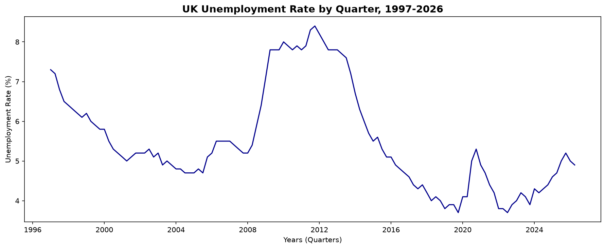
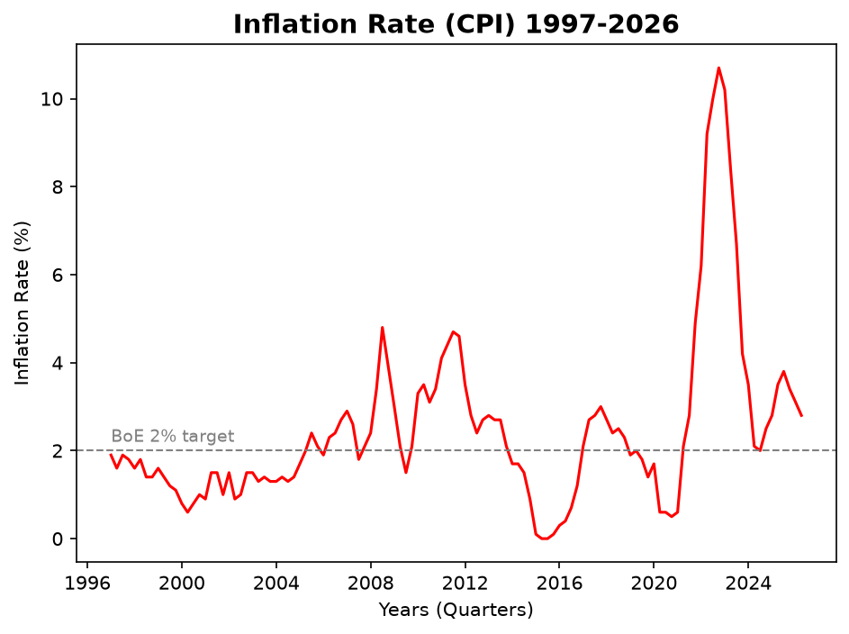
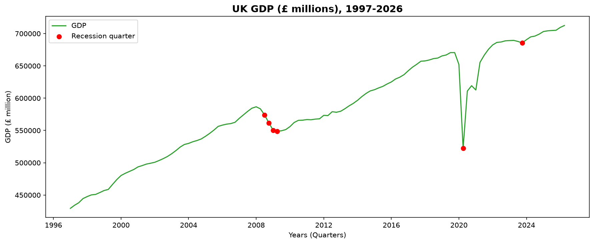
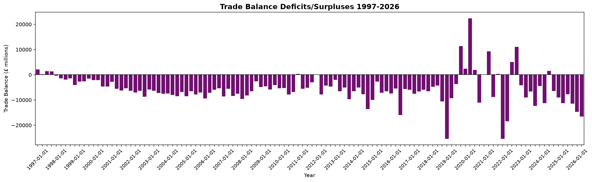

## Methodology

### Data source

All data is pulled from the [ONS API](https://www.ons.gov.uk) (Office for National Statistics), the UK's official source for economic statistics. Four indicators are tracked, each identified by a CDID (series code) and dataset:

| Indicator | CDID | Dataset | Frequency |
|---|---|---|---|
| Unemployment rate | MGSX | LMS | Quarterly |
| CPI inflation rate | D7G7 | MM23 | Quarterly |
| GDP (current prices) | YBHA | PN2 | Quarterly |
| Total trade balance | IKBJ | MRET | Quarterly |

The pipeline uses the ONS v1/beta API (`api.beta.ons.gov.uk`), which replaced the now-retired legacy timeseries endpoint. Each series is fetched via a two-step lookup: a search call resolves the CDID to a stable URI, and a data call retrieves the observations from that URI.

### Architecture: Medallion Architecture (Bronze/Silver/Gold)

The pipeline follows a three-layer medallion architecture, implemented with **DuckDB** as an embedded, file-based analytical database and **pandas** for in-memory transformation.

**Bronze — raw landing layer** (`notebooks/bronze/`)
Raw API responses are extracted and loaded as-is, with no cleaning or type conversion. Bronze tables are append-only: each pipeline run inserts new rows rather than overwriting existing ones (`CREATE TABLE IF NOT EXISTS ... LIMIT 0` followed by `INSERT INTO`), preserving a full history of every pull. Values remain as raw strings at this stage, including ONS's missing-value placeholder.

**Silver — cleaned layer** (`notebooks/silver/`)
Bronze data is cleaned and typed:
- Missing values (empty strings in the raw ONS response) are converted to true SQL `NULL`s using `NULLIF`, then cast to `DOUBLE`
- Raw ONS date strings (e.g. `"2026 Q1"`) are parsed into proper `DATE` values using `SUBSTRING` + `MAKE_DATE`
- The four indicators are joined into a single wide table (`silver_quarterly_metrics`), one row per quarter, using an inner join on date so only quarters with complete data across all four indicators are retained

Unlike bronze, silver is rebuilt from scratch on each run (`CREATE OR REPLACE TABLE`) rather than appended to, since it always reflects the current, cleaned state of bronze rather than accumulating history of its own.

**Gold — analytics layer** (`notebooks/gold/`)
Built on top of silver using SQL window functions:
- **Quarter-on-quarter change**: `LAG()` to compute the difference between each quarter and the one before it, for all four indicators
- **Yearly averages**: `AVG() OVER (PARTITION BY year)`, giving each quarterly row visibility into its year's overall average without collapsing the underlying quarterly detail
- **Technical recession flag**: a `CASE` statement flagging any quarter where GDP contracted for two consecutive quarters — the standard technical definition, chosen over alternatives like the Sahm Rule (a US-specific, monthly-frequency indicator that doesn't transfer cleanly to quarterly UK data)

Like silver, gold tables are rebuilt in full on each run.

Built a streamlit dashboard to display visualisations more effectively, users can pick which visualisation to view.

### Tooling

- **Extraction**: Python (`requests`) against the ONS API
- **Storage/transformation**: DuckDB, queried via both SQL and its native pandas DataFrame integration
- **Analysis/visualization**: pandas, matplotlib, seaborn, Streamlit
- **Environment**: managed via conda, with dependencies pinned in `requirements.txt`

### Known limitations

- The Bank of England base rate was considered as a fifth indicator but excluded from this version — it's published daily rather than quarterly (requiring a resampling decision) and comes from a separate source (the Bank of England's own database) with a CSV-based access pattern rather than a JSON API, which was out of scope for the initial build.
- The technical recession flag is a simplified, widely-used convention (two consecutive quarters of GDP contraction) rather than the UK's own more nuanced dating methodology.

## Visualisations

The gold layer feeds four core charts, generated in `notebooks/gold/04_gold_visualizations.ipynb` and saved to `charts/`.

### UK Unemployment Rate

Quarterly unemployment rate, 1997–2026. Clearly tracks the two major UK downturns: the 2008 financial crisis (peaking near 8.4% in 2011–12, with a lagged recovery) and the sharp but short-lived COVID-19 spike in 2020.

### UK CPI Inflation Rate

Quarterly CPI inflation against the Bank of England's 2% target. Highlights the 2022–23 cost-of-living crisis, where inflation ran well above target.

### UK GDP with Recession Markers

GDP at current prices (£ millions), with red markers on quarters meeting the standard technical recession definition (two consecutive quarters of negative growth). Correctly flags the 2008–09 financial crisis and the 2020 COVID contraction.

### UK Trade Balance

Quarterly trade balance (£ millions), surplus/deficit. The UK runs a persistent trade deficit in most quarters, briefly interrupted around 2020–21.

## Notes on methodology

- **Technical recession flag**: defined as two consecutive quarters of negative GDP growth — the standard UK/international convention. The Sahm Rule (a US-developed real-time recession indicator) was considered but not used, since it was designed for monthly US labour data and doesn't translate cleanly to quarterly UK figures.
- **Phillips curve**: exploratory analysis (unemployment vs. inflation, `notebooks/gold/03_gold_analysis.ipynb`) found a weak negative correlation (r ≈ -0.10) across the full 1997–2026 window — consistent with the well-documented "flattening" of the Phillips curve relationship observed across developed economies since the 2010s, rather than a strong trade-off as in earlier decades. Not included as a primary chart given the weak/inconclusive result, but the underlying data supports further investigation (e.g. splitting pre/post-2008 to test whether the relationship has shifted over time).
